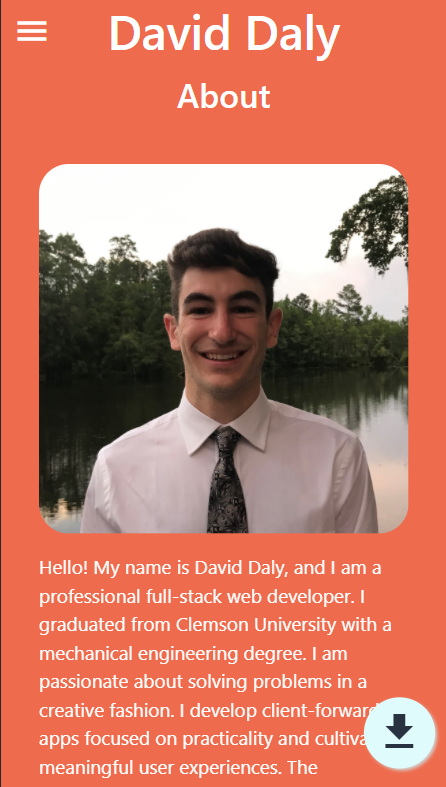

# Portfolio
## Table of Contents
* [Project Description](#project-description)
* [Installation](#installation)
* [Questions](#questions)

## Project Description
This is my professional and personal coding portfolio. It was built using React. It showcases just a few of my coding projects from personal experience and my bootcamp experience

## Installation
This is a website application: please go to this [link](https://dalyd14.github.io/)

## Questions
* Please visit my [GitHub Profile](https://github.com/dalyd14)
* If you have any questions regarding this project, please email me at [dalyd14@gmail.com](mailto:dalyd14@gmail.com)